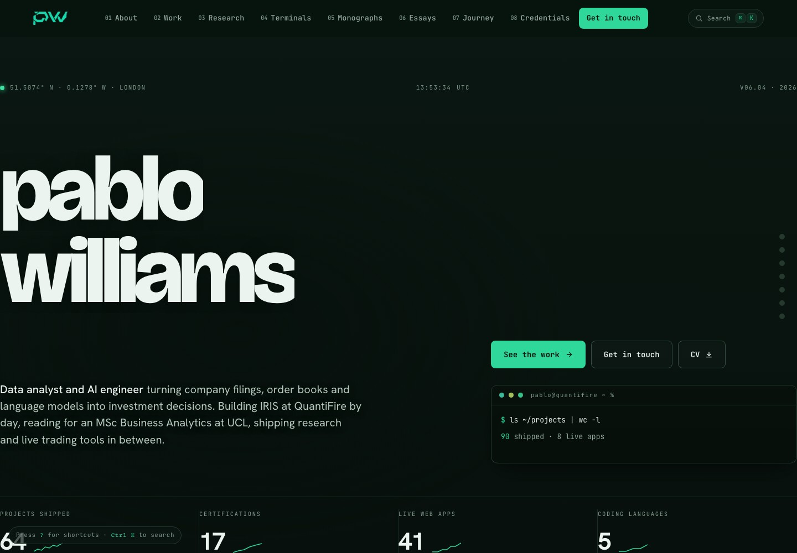
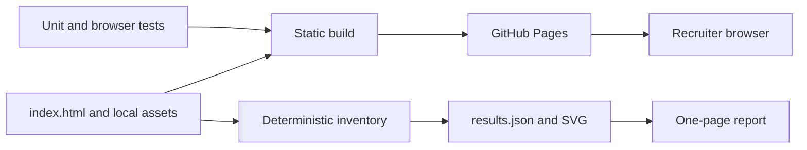

# Pablo Williams Portfolio
This Output is produced by Claude

This is the public index for Pablo Williams's applied AI, data, quantitative research and frontend work. A recruiter can move from a short professional overview to live demonstrations, source code, research reports and contact routes without an account, an intro gate or a hidden workflow. The [live site](https://pablowilliams.github.io/) is a static deployment with no runtime credentials.



## What I built

- A responsive, semantic single-page portfolio in [index.html](index.html), using HTML, CSS and browser JavaScript without a client framework.
- Project and research discovery through accessible navigation, filters and a command palette, with progressive enhancement.
- Search and social metadata, including a canonical URL, Open Graph fields and Person structured data.
- A deterministic evidence pipeline in [scripts/reproduce.mjs](scripts/reproduce.mjs) that measures the committed document and writes JSON and SVG artifacts.
- A quality pipeline with covered unit tests, Playwright browser tests, static build verification, secret scanning and gated GitHub Pages deployment.

## What I found

The canonical inventory in [reports/results.json](reports/results.json) records 14 semantic sections, 49 project or demo cards, 29 research cards and 100 GitHub links in the committed page. It reports no duplicate IDs or missing internal navigation targets. These are reproducible structural counts, not an assertion that every independently hosted external project is always available.

## Skills evidenced

- [Semantic HTML and responsive CSS](index.html)
- [JavaScript interface engineering](index.html)
- [Accessibility and browser testing](tests/e2e/portfolio.spec.mjs)
- [Reproducible analysis](scripts/reproduce.mjs)
- [Automated unit testing](tests/unit/site-model.test.mjs)
- [CI/CD and GitHub Actions](.github/workflows/quality.yml)
- [Static deployment](.github/workflows/deploy.yml)
- [Docker and service health checks](Dockerfile)
- [Technical architecture](docs/ARCHITECTURE.md)

## How to run

Requirements: Node.js 22 or newer, Python 3 and a Chromium browser installed through Playwright.

```bash
git clone https://github.com/pablowilliams/pablowilliams.github.io.git
cd pablowilliams.github.io
npm ci && npx playwright install chromium && npm run verify && npm run dev
```

Open `http://127.0.0.1:8000`.

The container path is `docker compose up --build`, then open `http://127.0.0.1:8080`.

## How it is tested

`npm run test:unit` runs more than 25 tests over the deterministic document model and enforces 80 percent line, function and branch coverage. `npm run test:e2e` runs 12 browser tests covering the rendered page, direct access, navigation integrity, the CV response, project links, research filtering, command search, contact routes, the mobile menu, 360 pixel overflow and reduced motion. `npm run lint` checks source syntax, required evidence, disclosure placement, internal links and metadata. `npm run typecheck` checks the JavaScript tooling with TypeScript.

## Architecture



See [docs/ARCHITECTURE.md](docs/ARCHITECTURE.md) and [docs/METHODOLOGY.md](docs/METHODOLOGY.md).

## Data and licence

The site uses committed portfolio copy, local previews and a local CV. It collects no visitor data and requires no secrets. Linked projects own their respective data and methodology. See [docs/DATA.md](docs/DATA.md), [LICENSE](LICENSE) and [CITATION.cff](CITATION.cff).

## Limitations and next steps

- External demos can move or become unavailable independently of this static index.
- The single HTML document is still large because it contains extensive inline presentation code and a legacy embedded media payload.
- The next design phase should split long collections into static detail pages, remove unused legacy media and recheck performance budgets.
- Quantitative claims on project cards must be verified in the linked source repository; this index does not recreate every experiment.

## Report

See [reports/pablowilliams-github-io-one-page-report.pdf](reports/pablowilliams-github-io-one-page-report.pdf), with its [Markdown source](reports/pablowilliams-github-io-one-page-report.md) beside it.
