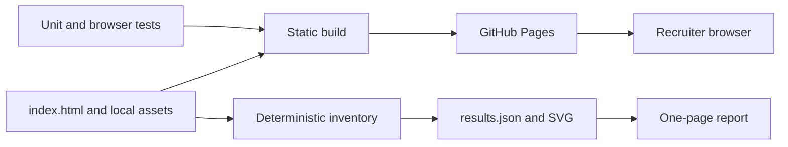

# Architecture

The portfolio is intentionally static. The browser receives one HTML document, local media, project previews and the CV. Interactive behavior is progressive enhancement: navigation, filtering, the command palette and decorative canvases do not control access to the underlying content.

## Runtime boundaries

- No application server, database, authentication service or runtime secret is required.
- External project and profile links are ordinary HTTPS links. The portfolio remains readable if those services are unavailable.
- Google Fonts are an enhancement; system fallbacks are declared.
- The CV and report are versioned local PDFs.

## Delivery controls

The quality workflow runs source checks, type checks, unit tests, browser tests, the deterministic inventory and the static build. The deployment workflow only publishes after the same verification command succeeds.
